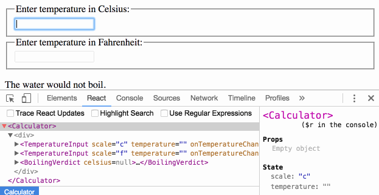

使用 react 经常会遇到几个组件需要共用状态数据的情况。这种情况下，我们最好将这部分共享的状态提升至他们最近的父组件当中进行管理。我们来看一下具体如何操作吧。

这部分内容当中，我们会创建一个温度计算器来计算水是否会在给定的温度下烧开。

开始呢，我们先创建一个名为 `BoilingVerdict` 的组件。它会接受 `celsius` 这个温度变量作为它的 prop 属性，最后根据温度判断返回内容：

```js{3,5}
function BoilingVerdict(props) {
  if (props.celsius >= 100) {
    return <p>水会烧开</p>;
  }
  return <p>水不会烧开</p>;
}
```

接下来，我们写一个名为 `Calculator` 的组件。它会渲染一个 `<input>` 来接受用户输入，然后将输入的温度值保存在 `this.state.temperature` 当中。

之后呢，它会根据输入的值渲染出 `BoilingVerdict` 组件。

```js{5,9,13,17-21}
class Calculator extends React.Component {
  constructor(props) {
    super(props);
    this.handleChange = this.handleChange.bind(this);
    this.state = {temperature: ''};
  }

  handleChange(e) {
    this.setState({temperature: e.target.value});
  }

  render() {
    const temperature = this.state.temperature;
    return (
      <fieldset>
        <legend>输入一个摄氏温度</legend>
        <input
          value={temperature}
          onChange={this.handleChange} />
        <BoilingVerdict
          celsius={parseFloat(temperature)} />
      </fieldset>
    );
  }
}
```

[在 CodePen 上试试。](http://codepen.io/valscion/pen/VpZJRZ?editors=0010)

## 添加第二个输入框

现在我们有了一个新的需求，在提供摄氏度输入的基础之上，再提供一个华氏温度输入，并且它们能保持同步。

我们可以通过从 `Calculator` 组件中抽离一个 `TemperatureInput` 组件出来。我们也会给它添加一个值为 `c` 或 `f` 的表示温度单位的 `scale` 属性。

```js{1-4,19,22}
const scaleNames = {
  c: 'Celsius',
  f: 'Fahrenheit'
};

class TemperatureInput extends React.Component {
  constructor(props) {
    super(props);
    this.handleChange = this.handleChange.bind(this);
    this.state = {temperature: ''};
  }

  handleChange(e) {
    this.setState({temperature: e.target.value});
  }

  render() {
    const temperature = this.state.temperature;
    const scale = this.props.scale;
    return (
      <fieldset>
        <legend>Enter temperature in {scaleNames[scale]}:</legend>
        <input value={temperature}
               onChange={this.handleChange} />
      </fieldset>
    );
  }
}
```

我们现在可以对`Calculator`稍作修改，来渲染两个不同的温度输入框。

```js{5,6}
class Calculator extends React.Component {
  render() {
    return (
      <div>
        <TemperatureInput scale="c" />
        <TemperatureInput scale="f" />
      </div>
    );
  }
}
```

[在 CodePen 上试试。](http://codepen.io/valscion/pen/GWKbao?editors=0010)


我们现在有了两个输入框，但是当你在其中一个输入时，另一个并不会更新。这显然是不符合我们的需求的。

另外，我们此时也不能从 `Calculator` 组件中展示 `BoilingVerdict` 的渲染结果。因为现在表示温度的状态数据只存在于 `TemperatureInput` 组件当中。

## 写出转换函数

首先，我们写两个可以将摄氏度和华氏度互相转换的函数。

```js
function toCelsius(fahrenheit) {
  return (fahrenheit - 32) * 5 / 9;
}

function toFahrenheit(celsius) {
  return (celsius * 9 / 5) + 32;
}
```

这两个函数只是单纯转换数字。我们还需要另外一个函数，它接受两个参数，第一个接受字符串 `temperature` 变量，第二个参数则是上面编写的单位转换函数。最后会返回一个字符串。我们会使用它来根据一个输入框的输入计算出另一个输入框的值。

我们最后取到输出的小数点后三位，而 `temperature` 输入不合法的时候，这个函数则会返回空字符串。

```js
function tryConvert(temperature, convert) {
  const input = parseFloat(temperature);
  if (Number.isNaN(input)) {
    return '';
  }
  const output = convert(input);
  const rounded = Math.round(output * 1000) / 1000;
  return rounded.toString();
}
```

举两个例子，`tryConvert('abc', toCelsius)` 会返回空字符串，而 `tryConvert('10.22', toFahrenheit)` 会返回 `'50.396'`。

## 状态提升

到这一步为止，两个`TemperatureInput`组件都是在自己的 state 中独立保存数据。

```js{5,9,13}
class TemperatureInput extends React.Component {
  constructor(props) {
    super(props);
    this.handleChange = this.handleChange.bind(this);
    this.state = {temperature: ''};
  }

  handleChange(e) {
    this.setState({temperature: e.target.value});
  }

  render() {
    const temperature = this.state.temperature;
```

但是，我们想要的是这两个输入能保持同步。当我们更新摄氏输入（Celsius）时，华氏度（Fahrenheit ）这个框应该能显示转换后的的温度数值，反之亦然。

在React中，状态分享是通过将state数据提升至离需要这些数据的组件最近的父组件来完成的。这就是所谓的**状态提升**。我们会将 `TemperatureInput` 组件自身保存的 state 移到 `Calculator` 中。

如果 `Calculator` 组件拥有了提升上来共享的状态数据，那它就会成为两个温度输入组件的“数据源”。它会传递给下面温度输入组件一致的数据。由于两个 `TemperatureInput` 温度组件的props属性都是来源于共同的父组件 `Calculator`，它们的数据也会保持同步。

让我们一步一步来分析如何操作。

首先，我们在 `TemperatureInput` 组件中将 `this.state.temperature` 替换为 `this.props.temperature` 。从现在开始，我们假定 `this.props.temperature` 属性已经存在了，不过之后仍然需要将数据从 `Calculator` 组件中传进去。

```js{3}
  render() {
    // 之前的代码: const temperature = this.state.temperature;
    const temperature = this.props.temperature;
```

我们首先知道[props是只读的](components-and-props.html#props-are-read-only)
这么一个事实。而之前`temperature`变量是被保存在其自身的 state 中的，`TemperatureInput` 组件只需要调用 `this.setState()` 就能改变它。但现在，`temperature` 是作为 prop 从父组件传递下来的，`TemperatureInput` 组件是没有控制权的。

在React中，这个问题通常是通过让组件“受控”来解决。就像 `<input>` 能够接受 `value` 和 `onChange` 这两个prop属性值，自定义组件 `TemperatureInput` 也能接受来自 `Calculator` 父组件的 `temperature` 变量和 `onTemperatureChange` 方法作为props属性值。

做完这些，当 `TemperatureInput` 组件更新它的温度数值时，就会调用 `this.props.onTemperatureChange` 方法。

```js{3}
  handleChange(e) {
    // 之前的代码: this.setState({temperature: e.target.value});
    this.props.onTemperatureChange(e.target.value);
```

需要指出的是，我们现在定义的 `temperature` 和 `onTemperatureChange` 这些prop属性的命名没有特殊含义，我们也可以起个其他任何的名字，像是`value`和`onChange`这些只是命名习惯罢了。

`onTemperatureChange` 和 `temperature` 两个 props 属性均由父组件 `Calculator` 提供。父组件可以通过自身的方法来响应状态数据的改变，从而使用新的值来重新渲染两个输入框组件。不过我们先放着，最后再来修改它。

在我们改写 `Calculator` 组件之前，我们先花点时间总结下 `TemperatureInput` 组件的改变。我们将其自身的 state 从组件中移除，使用 `this.props.temperature` 替代 `this.state.temperature` ，当我们想要响应数据改变时，使用父组件提供的 `this.props.onTemperatureChange()` 而不是`this.setState()` 方法：

```js{8,12}
class TemperatureInput extends React.Component {
  constructor(props) {
    super(props);
    this.handleChange = this.handleChange.bind(this);
  }

  handleChange(e) {
    this.props.onTemperatureChange(e.target.value);
  }

  render() {
    const temperature = this.props.temperature;
    const scale = this.props.scale;
    return (
      <fieldset>
        <legend>在{scaleNames[scale]}:中输入温度数值</legend>
        <input value={temperature}
               onChange={this.handleChange} />
      </fieldset>
    );
  }
}
```

现在让我们来看看 `Calculator` 组件。

我们将会在它的 state 中存储之前输入框组件的 `temperature` 和 `scale` 值，这是从输入框组件中“提升”上来的 state，它将会成为两个输入框组件的“数据源”。这是我们所需要的能够重新渲染并且表示两个不同输入组件的最基本的数据。

举个例子，假如我们在摄氏度输入框中输入37，那么 `Calculator` 的 state 就是：

```js
{
  temperature: '37',
  scale: 'c'
}
```

如果我们之后在华氏度输入框输入212，那么 `Calculator` 的状态数据就会是：

```js
{
  temperature: '212',
  scale: 'f'
}
```

其实我们可以一起保存两个输入的值，但这么做似乎没有必要。保存最近
改变的值和所需标识的温标单位就足够了。我们可以只需基于当前的 `temperature` 和 `scale` 计算出另一个输入框中的值。

现在这两个输入框中的值能保持同步了，因为它们使用的是通过同一个 state 计算出来的值。

```js{6,10,14,18-21,27-28,31-32,34}
class Calculator extends React.Component {
  constructor(props) {
    super(props);
    this.handleCelsiusChange = this.handleCelsiusChange.bind(this);
    this.handleFahrenheitChange = this.handleFahrenheitChange.bind(this);
    this.state = {temperature: '', scale: 'c'};
  }

  handleCelsiusChange(temperature) {
    this.setState({scale: 'c', temperature});
  }

  handleFahrenheitChange(temperature) {
    this.setState({scale: 'f', temperature});
  }

  render() {
    const scale = this.state.scale;
    const temperature = this.state.temperature;
    const celsius = scale === 'f' ? tryConvert(temperature, toCelsius) : temperature;
    const fahrenheit = scale === 'c' ? tryConvert(temperature, toFahrenheit) : temperature;

    return (
      <div>
        <TemperatureInput
          scale="c"
          temperature={celsius}
          onTemperatureChange={this.handleCelsiusChange} />
        <TemperatureInput
          scale="f"
          temperature={fahrenheit}
          onTemperatureChange={this.handleFahrenheitChange} />
        <BoilingVerdict
          celsius={parseFloat(celsius)} />
      </div>
    );
  }
}
```

[在 Codepen 上试试。](http://codepen.io/valscion/pen/jBNjja?editors=0010)

现在，无论你编辑哪一个输入框，`Calculator` 组件中 `this.state.temperature` 和 `this.state.scale` 都会更新。其中之一的输入框得到用户原样输入的值，另一个输入框总是显示基于这个值计算出的结果。

让我们梳理下编辑输入框时所发生的一系列活动：

* React在DOM原生组件`<input>`上调用指定的`onChange`函数。在本例中，指的是`TemperatureInput`组件上的`handleChange`函数。
* `TemperatureInput`组件的`handleChange`函数会在值发生变化时调用`this.props.onTemperatureChange()`函数。这些props属性，像`onTemperatureChange`都是由父组件`Calculator`提供的。
* 当最开始渲染时，`Calculator`组件把内部的`handleCelsiusChange`方法指定给摄氏输入组件`TemperatureInput`的`onTemperatureChange`方法，并且把`handleFahrenheitChange`方法指定给华氏输入组件`TemperatureInput`的`onTemperatureChange`。两个`Calculator`内部的方法都会在相应输入框被编辑时被调用。
* 在这些方法内部，`Calculator`组件会让React使用编辑输入的新值和当前输入框的温标来调用`this.setState()`方法来重渲染自身。
* React会调用`Calculator`组件的`render`方法来识别UI界面的样子。基于当前温度和温标，两个输入框的值会被重新计算。温度转换就是在这里被执行的。
* 接着React会使用`Calculator`指定的新props来分别调用`TemperatureInput`组件.React也会识别出子组件的UI界面。
* React DOM 会更新DOM来匹配对应的值。我们编辑的输入框获取新值，而另一个输入框则更新经过转换的温度值。

一切更新都是经过同样的步骤，因而输入框能保持同步的。

## 经验教训

在React应用中，对应任何可变数据理应只有一个单一“数据源”。通常，状态都是首先添加在需要渲染数据的组件中。此时，如果另一个组件也需要这些数据，你可以将数据提升至离它们最近的父组件中。你应该在应用中保持 [自上而下的数据流](state-and-lifecycle.html#the-data-flows-down)，而不是尝试在不同组件中同步状态。

状态提升比双向绑定方式要写更多的“模版代码”，但带来的好处是，你也可以更快地寻找和定位bug的工作。因为哪个组件保有状态数据，也只有它自己能够操作这些数据，发生bug的范围就被大大地减小了。此外，你也可以使用自定义逻辑来拒绝或者更改用户的输入。

如果某些数据可以由props或者state提供，那么它很有可能不应该在state中出现。举个例子，我们仅仅保存最新的编辑过的`temperature`和`scale`值，而不是同时保存 `celsiusValue` 和 `fahrenheitValue` 。另一个输入框中的值总是可以在 `render()` 函数中由这些保存的数据计算出来。这样我们可以根据同一个用户输入精准计算出两个需要使用的数据。

当你在开发UI界面遇到问题时，你可以使用 [React 开发者工具](https://github.com/facebook/react-devtools)来检查props属性，并且可以点击查看组件树，直到你找到负责目前状态更新的组件。这能让你到追踪到产生 bug 的源头。


